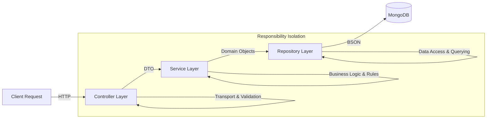

# Identity Service (User Management System)

> **Enterprise-Grade Node.js Microservice** demonstrating strict separation of concerns, specialized database optimization patterns, and production-ready resilience mechanisms.

## 🚀 Engineering Overview

This service is not just a CRUD application; it is an architectural reference for building scalable, maintainable, and resilient Node.js backends. It solves common distributed system problems—like **data consistency**, **request idempotency**, and **database connection stalling**—through robust engineering practices.

### Core Philosophy
1.  **Resilience First**: The system is designed to "fail fast" and handle network partitions gracefully using strict timeouts.
2.  **Performance by Default**: Every database query is optimized with index-aware strategies and lean execution.
3.  **Strict Layering**: Business logic (Service) is completely decoupled from HTTP transport (Controller) and Data Access (Repository).

---

## � Advanced Technical Implementation

This codebase implements several advanced patterns to solve real-world production scale issues:

### 1. Hybrid Pagination Strategy (Cursor + Offset)
**Problem**: Traditional "Offset" pagination (`skip(10000).limit(10)`) becomes exponentially slower as data grows because the database must scan and discard thousands of documents.
**Solution**: Implemented a dual-mode strategy.
-   **Cursor-Based Navigation (O(1))**: Uses `_id` as a pointer for "Next/Previous" navigation. This delivers constant-time performance regardless of dataset size.
-   **Offset-Based Fallback**: Still supports "Jump to Page 5" for specific random access cases.


### 2. Database Resilience & Circuit Breaking
**Problem**: In high-load scenarios, a hanging database connection can exhaust the connection pool, causing the entire application to become unresponsive (the "thundering herd" problem).
**Solution**: Strict timeouts imposed at multiple levels.
-   **Connection Timeout (`serverSelectionTimeoutMS: 5000`)**: If the DB is unreachable, fail immediately rather than waiting default 30s.
-   **Socket Timeout (`socketTimeoutMS: 45000`)**: Kills idle connections to free up resources.
-   **Query-Level Timeout (`maxTimeMS(10000)`)**: Every repository call has a strict 10s execution limit.


### 3. Duplicate Request Prevention (Idempotency)
**Problem**: Users double-clicking submit buttons or network retries can cause duplicate resource creation.
**Solution**: Custom Rate Limiting middleware designed specifically for write operations.
-   **Mechanism**: A strict `windowMs` lock prevents the same IP from triggering sensitive endpoints more than once every 2 seconds.

### 4. ESR Pattern Indexing
**Problem**: Incorrect index order renders indexes useless for sorting.
**Solution**: Applied the **Equality - Sort - Range (ESR)** rule to Mongoose schemas.
-   Indexes are structured to first filter exact matches (e.g., `role`), then apply sorting (e.g., `createdAt`), ensuring the sort operation never hits memory.

---

## 🏗 System Architecture

The project adheres to a strict **Repository-Service-Controller** layered architecture (a "DDD-Lite" approach).



-   **Controller**: Pure input/output handling. Zero business logic.
-   **Service**: The "Brain". Handles hashing, complex validation, and algorithm choice.
-   **Repository**: The "Hand". Knows how to talk to the DB. If we switch to SQL, only this layer changes.

## 🛠 Tech Stack

This project uses a focused selection of production-proven libraries (no bloat):

- **Core**:
  - `express`: Robust web framework for handling HTTP traffic.
  - `dotenv`: Environment variable management for secure configuration.
- **Database**:
  - `mongoose`: Elegant object modeling for MongoDB with schema enforcement.
- **Security & Validation**:
  - `bcrypt`: Industry-standard library for hashing user passwords.
  - `zod`: TypeScript-first schema declaration and validation library (used for strict request body & param validation).
  - `express-rate-limit`: Middleware to prevent brute-force attacks and "double-click" scenarios.
- **Dev Tooling**:
  - `nodemon`: Hot-reloading for rapid local development.

---

## 📂 Project Structure

A clean, modular structure that scales by feature, not by technical role.

```
src/
├── config/             # Database & Environment Configuration
├── middlewares/        # Custom Middleware (Rate Limiters, Error Handling)
├── modules/            # Domain Modules
│   └── user/
│       ├── user.controller.js  # HTTP Transport Layer
│       ├── user.service.js     # Business Logic Layer
│       ├── user.repo.js        # Data Access Layer
│       ├── user.model.js       # Database Schema
│       └── user.routes.js      # Route Definitions
├── utils/              # Shared Utilities (AsyncHandler, ApiError)
└── server.js           # Entry Point
```

---

## ⚡ Quick Start

### Prerequisites
-   Node.js v18+
-   MongoDB (Local or Atlas)
-   Docker (Optional)

### Installation

1.  **Clone & Install**
    ```bash
    git clone <repo-url>
    npm install
    ```

2.  **Environment Setup**
    Create `.env`:
    ```env
    PORT=5000
    MONGO_URI=mongodb://localhost:27017/identity-service
    ```

3.  **Run Application**
    ```bash
    # Development (Hot Reload)
    npm run dev
    
    # Production Mode
    npm start
    ```

### Docker Deployment
The service is fully containerized.
```bash
docker-compose up -d --build
```

---

## 🔌 API Reference

| Method | Endpoint | Description |
| :--- | :--- | :--- |
| `GET` | `/users` | List users with cursor/offset pagination strategies |
| `POST` | `/users` | Create user (Rate-limited & Validated) |
| `GET` | `/users/:id` | Get user profile |
| `DELETE` | `/users/:id` | Soft/Hard delete user |

---

*Architected by Ravi*
