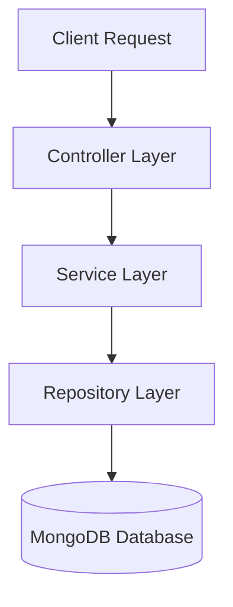

# Identity Service (User Management System)

> A robust, modular, and scalable Node.js backend service designed for Identity Management and User Administration. Built with enterprise-grade practices in mind, utilizing the **Repository-Service-Controller** architecture.

    

## 🚀 Overview

The **Identity Service** is a dedicated microservice responsible for handling user authentication, authorization, and profile management. It is architected to separate concerns strictly, ensuring maintainability, testability, and scalability.

This project demonstrates a production-ready folder structure and integrates modern tooling for validation, security, and performance.

## 🛠 Tech Stack

- **Runtime**: Node.js
- **Framework**: Express.js
- **Database**: MongoDB (via Mongoose ODM)
- **Containerization**: Docker & Docker Compose
- **Validation**: Zod (Planned integration)
- **Security**: 
  - `bcrypt`: Password Hashing
  - `jsonwebtoken` (JWT): Stateless Authentication
  - `express-rate-limit`: DDoS protection & API throttling
- **Performance**: Redis (Planned caching layer)
- **Logging**: Winston (Structured logging)
- **Testing**: Jest & Supertest

## 🏗 Architecture

This project follows the **Layered Architecture** (Service-Repository Pattern) to decouple business logic from data access and HTTP transport.



- **Controller**: Handles incoming HTTP requests, input parsing, and response formatting.
- **Service**: Contains the core business logic (e.g., password hashing, complex validations).
- **Repository**: Manages direct database interactions (CRUD operations), keeping queries isolated.

## 📂 Project Structure

```
src/
├── modules/              # Domain-specific modules
│   └── user/
│       ├── user.controller.js  # Request Handlers
│       ├── user.service.js     # Business Logic
│       ├── user.repo.js        # Data Access Layer
│       ├── user.model.js       # Mongoose Schema
│       ├── user.routes.js      # API Routes
│       └── user.validation.js  # Input Schemas
├── server.js             # Application Entry Point
└── ...
```

## ✅ Current Progress

### User Module
- [x] **Database Schema**: Defined rigorous Mongoose schema with type safety, validations (email, required fields), and enum roles (`user`, `admin`).
- [x] **API Routes**: Configured modular routing for user-related endpoints.
- [x] **Data Fetching flow**: Implemented the full flow for `GET /users` (Controller -> Service -> Repo -> DB).
- [ ] **Authentication**: JWT & Hash implementation (Dependencies installed).
- [ ] **Validation Middleware**: Zod integration (File created).

## ⚡ Getting Started

### Prerequisites
- Node.js (v18+)
- MongoDB (Local or Atlas)

### Installation

1. **Clone the repository**
   ```bash
   git clone <repo-url>
   cd identity-service
   ```

2. **Install dependencies**
   ```bash
   npm install
   ```

3. **Configure Environment**
   Create a `.env` file in the root:
   ```env
   PORT=5000
   MONGO_URI=your_mongodb_connection_string
   ```

4. **Run the server**
   ```bash
   # Development mode with hot-reload
   npm run dev
   
   # Production start
   npm start
   ```

### 🐳 Run with Docker

Easily spin up the entire environment (App + MongoDB) using Docker Compose.

```bash
# Build and start services in background
docker-compose up -d

# Check running containers
docker-compose ps

# View logs
docker-compose logs -f
```

## ✨ Key Features

- **Repository Pattern**: Strict separation of concerns for scalable code maintenance.
- **Dockerized**: Fully containerized environment for consistent deployment.
- **Type-Safe Models**: Robust Mongoose schemas with built-in validation.
- **Modular Structure**: Domain-driven design principles applied to folder structure.

---
*Built with ❤️ by Ravi*
